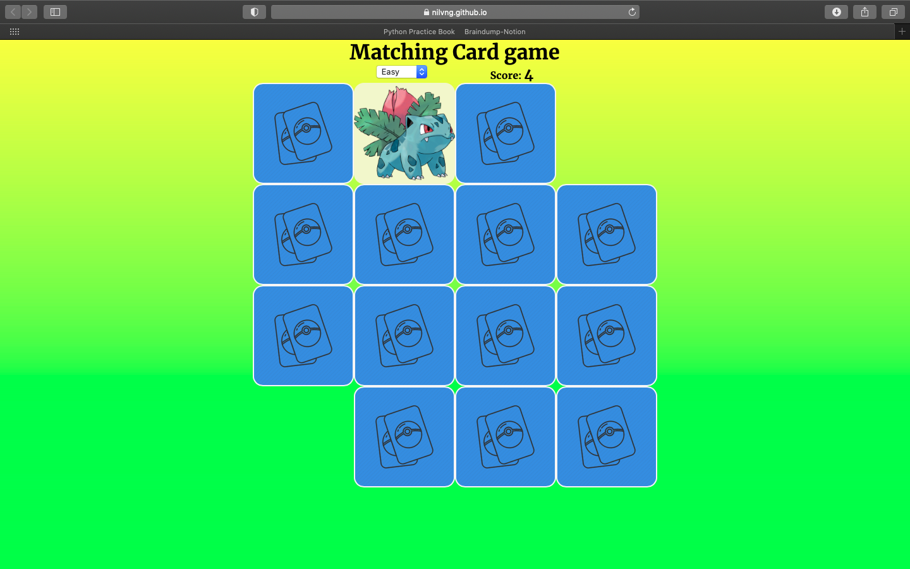

# MatchingCardGame

A simple Matching Card game with 3 levels corresponding to 3 different grids: 4x4, 6x6 and 8x8.

## What I learnt

- Exposed the mindset of game designer and game developer
- Accumulated experience working with JavaScript and CSS
